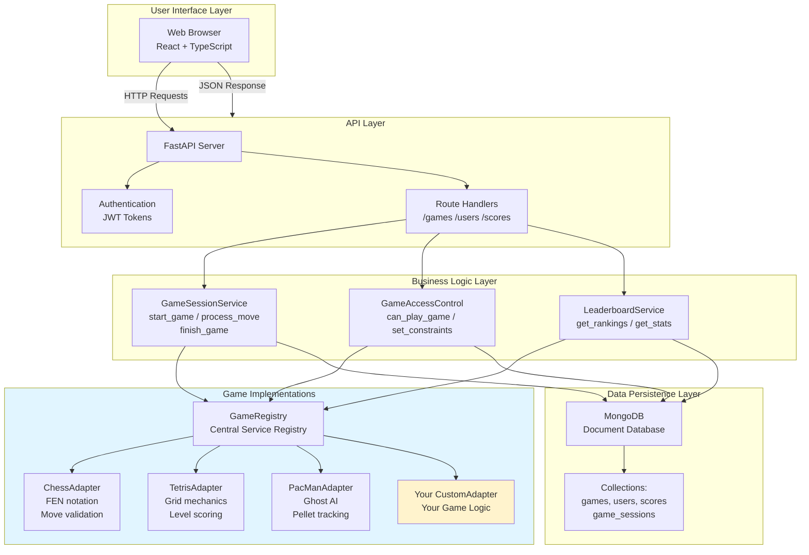

# Scalable Game Platform Architecture

## Overview

This document describes the architecture for a highly scalable, extensible arcade games platform that supports:

- **Multiple game types** (arcade classics, board games, puzzles) with different scoring systems
- **User access control** (age restrictions, game whitelisting, parental controls)
- **Flexible game state management** (each game stores state however it needs)
- **Generic leaderboards** (global, time-based, friend-based)
- **Session management** (saving/resuming unfinished games)
- **Extensibility** (adding new games without modifying existing code)

## Core Principle: The Game Adapter Pattern

The entire architecture is built around the **Game Adapter Pattern**, which allows new games to be added as completely independent implementations without touching existing code.

### Key Insight

Rather than hardcoding game logic into the backend, each game is a **self-contained adapter** that must implement a well-defined interface. This follows the **Open/Closed Principle**: the system is open for extension (adding new games) but closed for modification (existing games are never touched).

## System Architecture Diagram



## Architecture Layers

### 1. Game Adapter Layer (`app/services/game_adapter.py`)

```
┌─────────────────────────────────────────────────────────┐
│                    GameAdapter (ABC)                     │
├──────────────────────────────────────────────────────────┤
│ Methods every game must implement:                       │
│  • get_metadata() → GameMetadata                         │
│  • create_new_game(user_id) → Dict[game_state]          │
│  • process_move(game_state, move) → Dict[game_state]    │
│  • is_game_over(game_state) → (bool, winner_id)         │
│  • calculate_score(game_state, duration) → Dict         │
│  • validate_game_state(game_state) → bool               │
│  • Optional: get_legal_moves, get_ai_move               │
└──────────────────────────────────────────────────────────┘
         ▲           ▲           ▲           ▲
         │           │           │           │
    ChessAdapter TetrisAdapter PacManAdapter [YourGameAdapter]
```

### 2. Game Registry

The `GameRegistry` maintains a dictionary of all available games:

```python
GameRegistry.register('chess', ChessAdapter())
GameRegistry.register('tetris', TetrisAdapter())
# Later...
adapter = GameRegistry.get('chess')
all_games = GameRegistry.list_all()
```

**Why this matters for scalability:**
- New games are registered at startup without modifying existing code
- Games can be loaded dynamically from plugins/modules
- The registry can be queried by the frontend to discover available games

### 3. Data Models

#### Game Metadata (`GameMetadata`)
```python
class GameMetadata(BaseModel):
    id: str                    # 'chess', 'tetris', etc
    title: str
    genre: str
    
    # Game characteristics
    game_type: str             # 'arcade', 'boardgame', 'puzzle'
    min_players: int
    max_players: int
    
    # Scoring information
    scoring_type: str          # 'points', 'time', 'rating', 'custom'
    scoring_direction: str     # 'higher_better' or 'lower_better'
    max_score: Optional[float]
```

This metadata describes the game itself and is shared across all instances.

#### Game Session (`GameSession`)
```python
class GameSession(BaseModel):
    id: str                    # Unique session ID
    user_id: str              # Who's playing
    game_id: str              # Which game
    
    status: str               # 'in_progress', 'completed', 'abandoned'
    
    # Generic state - each game stores different data
    game_state: Dict[str, Any]
    
    # Flexible scoring
    score: Optional[float]
    score_breakdown: Dict[str, Any]
```

**Key insight:** The `game_state` is completely generic. Chess stores a FEN string and move history. Tetris stores a 2D grid. Pac-Man stores positions and pellets. Each game decides what to persist.

#### Flexible Score Model (`Score`)
```python
class Score(BaseModel):
    score_value: float         # The actual score (100 points, etc)
    score_type: str            # What kind (points, time, rating, etc)
    score_breakdown: Dict      # Details: {base: 100, bonus: 25, total: 125}
    is_record: bool           # Is this a personal best?
```

### 4. Game Session Service

The `GameSessionService` orchestrates the game lifecycle:

```
User starts game
         ↓
 GameSessionService.start_game()
         ↓
 Create GameSession with adapter.create_new_game()
         ↓
 Save to MongoDB
         ↓
 Return session to client
```

**Processing moves:**

```
Client sends move {'action': 'rotate'}
         ↓
 GameSessionService.process_move()
         ↓
 adapter.process_move(old_state, move) → new_state
         ↓
 adapter.is_game_over(new_state) → (true/false, winner)
         ↓
 If over: adapter.calculate_score(new_state, duration)
         ↓
 Save to GameSession & scores collection
```

### 5. Access Control Service

The `GameAccessControl` enforces:

```python
async def can_play_game(user_id: str, game_id: str) -> bool:
    # Check explicit whitelist (for parental controls)
    if user.restricted_games:
        return game_id in user.accessible_game_ids
    
    # Check age-based restrictions
    user_age = user.age_group  # 'kid', 'teen', 'adult'
    required = game_access_rules.get(game_id).required_min_age
    return user_age >= required
```

**Use cases:**

1. **Parental controls:** Set `user.restricted_games = True` and list allowed games
2. **Age restrictions:** Certain games only for 'adult' users
3. **Sunsetting games:** Remove from registry when older game is retired

### 6. Leaderboard Service

The `LeaderboardService` provides ranking data:

```python
# Global leaderboard
leaderboard = await service.get_global_leaderboard(
    game_id='tetris',
    time_period='weekly',  # 'daily', 'weekly', 'all_time'
    limit=100
)

# Friend leaderboard
leaderboard = await service.get_friend_leaderboard(
    user_id=current_user,
    game_id='tetris'
)

# User stats
stats = await service.get_user_game_stats(user_id, game_id)
# Returns: best score, average, play count, rank, etc.
```

## How to Add a New Game

This is where the scalability shines. To add Chess:

### Step 1: Create an adapter (`app/services/games/chess_adapter.py`)

```python
class ChessAdapter(BoardGameAdapter):
    def get_metadata(self):
        return GameMetadata(
            id="chess",
            title="Chess",
            scoring_type="points",
            # ... etc
        )
    
    def create_new_game(self, user_id, difficulty=None):
        return {
            'fen': 'rnbqkbnr/pppppppp/8/8/8/8/PPPPPPPP/RNBQKBNR w KQkq - 0 1',
            'moves': [],
            'current_player': 'white'
        }
    
    def process_move(self, game_state, move):
        # Validate move against current FEN
        # Return updated FEN, move list
        pass
    
    def is_game_over(self, game_state):
        # Check for checkmate, stalemate, three-fold repetition
        pass
    
    def calculate_score(self, game_state, duration_seconds):
        # Chess scoring: victory bonus + move count
        pass
    
    def validate_game_state(self, game_state):
        # Ensure valid chess position
        pass
```

### Step 2: Register at startup

In `app/config.py` or server initialization:

```python
from app.services.game_adapter import GameRegistry
from app.services.games.chess_adapter import ChessAdapter

GameRegistry.register('chess', ChessAdapter())
```

### Step 3: Done!

The game is immediately available:
- Listed in `/games` endpoint
- Can be started with `/games/chess/start`
- Appears in leaderboards
- Respects access control rules

**No existing code is modified.** Chess is completely independent of Tetris or Pac-Man.

## Database Schema

### `game_sessions` collection
```javascript
{
  _id: ObjectId(),
  user_id: "user123",
  game_id: "chess",
  status: "in_progress",        // or "completed", "abandoned"
  game_state: {
    fen: "...",
    moves: [...],
    current_player: "white"
  },
  score: 150,
  score_breakdown: {
    moves: 42,
    move_points: 84,
    ...
  },
  started_at: ISODate(),
  completed_at: ISODate(),
  created_at: ISODate(),
  updated_at: ISODate()
}
```

### `scores` collection (leaderboard)
```javascript
{
  _id: ObjectId(),
  user_id: "user123",
  game_id: "chess",
  game_session_id: ObjectId(),
  score_value: 150,
  score_type: "points",
  score_breakdown: {...},
  is_record: true,
  difficulty_level: "normal",
  achieved_at: ISODate(),
  play_duration_seconds: 1800
}
```

### `users` collection (with access control)
```javascript
{
  _id: "user123",
  username: "alice",
  email: "alice@example.com",
  password_hash: "...",
  
  // Access control
  restricted_games: false,           // If true, only accessible_game_ids
  accessible_game_ids: ["chess"],    // Whitelist when restricted
  age_group: "adult",                // 'kid', 'teen', 'adult'
  
  // Social
  favorite_game_ids: ["chess", "tetris"],
  friend_ids: ["user456", "user789"],
  
  // Progress
  current_game_session_id: ObjectId(),
  
  created_at: ISODate()
}
```

## Interesting Design Decisions

### 1. Generic `game_state` field

Rather than having separate collections for each game's state, we use a single generic `game_state` dict. This means:

- **Chess** can store: `{fen, moves, current_player}`
- **Tetris** can store: `{grid, current_piece, next_piece, level, score}`
- **Poker** could store: `{hand, community_cards, pot, players_state}`
- **Custom game** can store whatever it needs

This is scalable because adding new games **never requires changing the schema**.

### 2. Flexible Scoring

Different games need different scoring:

- **Arcade** (Pac-Man): Based on points and time
- **Puzzle** (Tetris): Based on level and lines cleared
- **Board game** (Chess): Win/loss with possible rating adjustments

The `Score` model accommodates this with:
```
score_value: 150                          // The actual score
score_breakdown: {                        // How it was calculated
  base_points: 100,
  level_multiplier: 1.5,
  time_bonus: 50
}
```

### 3. Base Adapter Classes

Rather than forcing all games to implement complex logic, we provide base classes:

```python
class SimpleArcadeGameAdapter(GameAdapter):
    """Pre-implements scoring for arcade games"""
    def calculate_score(self, game_state, duration_seconds):
        base_points = game_state.get('points', 0)
        time_bonus = max(0, (300 - duration_seconds) * 10)
        return {
            'score_value': base_points + time_bonus,
            'score_breakdown': {...}
        }

class PuzzleGameAdapter(GameAdapter):
    """Pre-implements scoring for puzzles"""
    def calculate_score(self, game_state, duration_seconds):
        level = game_state.get('level', 1)
        base_score = game_state.get('points', 0)
        level_multiplier = 1 + (level - 1) * 0.1
        return {
            'score_value': base_score * level_multiplier,
            'score_breakdown': {...}
        }
```

This reduces code duplication for similar games.

## Frontend Integration

### Game Discovery

```typescript
// Get all games user can play
const games = await api.get('/games?user_id=user123');

// Get a specific game's details
const metadata = await api.get('/games/chess?user_id=user123');
```

### Starting a Game

```typescript
// Start new session
const session = await api.post('/games/chess/start', {
  user_id: 'user123',
  difficulty: 'intermediate'
});

// Get the game_state
const gameState = session.game_state;
// For chess: {fen, moves, current_player}
// The UI then renders this appropriately
```

### Making Moves

```typescript
// Send move (format depends on game)
const result = await api.post('/games/chess/sessions/{sessionId}/move', {
  from: 'e2',
  to: 'e4',
  promotion: undefined
});

if (result.is_game_over) {
  console.log('Game over!', result.winner);
  // Save score
}
```

### Leaderboards

```typescript
// Global leaderboard
const leaderboard = await api.get('/games/tetris/leaderboard?time_period=weekly&limit=100');

// Friend leaderboard
const friends = await api.get('/games/tetris/leaderboard/friends?user_id=user123');

// Personal stats
const stats = await api.get('/games/tetris/user/user123/stats');
// Returns: {best_score, average_score, total_plays, rank, last_played}
```

## Scaling Considerations

### Load Testing Scenarios

1. **Many simultaneous games:** Each session is independent, stored in MongoDB
2. **Large leaderboards:** MongoDB aggregation pipeline efficiently ranks users
3. **Adding new games:** Zero impact on existing games (truly independent)
4. **High user volume:** Stateless API, easy to scale horizontally

### MongoDB Indexing Strategy

```javascript
// game_sessions collection
db.game_sessions.createIndex({ user_id: 1, status: 1 });
db.game_sessions.createIndex({ game_id: 1, status: 1 });
db.game_sessions.createIndex({ completed_at: -1 });

// scores collection (leaderboard queries)
db.scores.createIndex({ game_id: 1, score_value: -1 });
db.scores.createIndex({ user_id: 1, game_id: 1 });
db.scores.createIndex({ achieved_at: -1 });
db.scores.createIndex({ user_id: 1, is_record: 1 });

// users collection
db.users.createIndex({ username: 1 }, { unique: true });
db.users.createIndex({ email: 1 }, { unique: true });
```

### Potential Performance Optimizations

1. **Leaderboard caching:** Cache top 100 scores in Redis, invalidate when scores change
2. **Game metadata caching:** Metadata rarely changes, cache in app memory or Redis
3. **Async score processing:** Use message queue (Celery, Bull) for score calculations
4. **CDN for game assets:** All JavaScript/WebGL for games served from CDN
5. **WebSocket for real-time multiplayer:** Socket.io for live board updates

## Future Extensions

This architecture naturally supports:

- **Multiplayer games:** Add `other_players` to GameSession, use WebSocket for real-time updates
- **AI opponents:** `adapter.get_ai_move()` implemented by adapter
- **Game tournaments:** Meta-layer on top of leaderboards
- **Achievements/badges:** Separate collection linked to Score records
- **Replays:** Full game_state snapshots already stored with scores
- **In-game purchases:** Cosmetics, power-ups (game-specific in game_state)
- **Social features:** Already have friend lists, can extend
- **Analytics:** All moves, states, and scores are persisted for analysis

## Summary

This architecture achieves **true scalability and extensibility** by:

1. **Defining a clear adapter interface** all games must follow
2. **Making game_state completely generic** (no schema changes for new games)
3. **Using a registry pattern** to decouple game discovery from game implementation
4. **Implementing access control at service layer** (not hardcoded per-game)
5. **Designing the database for flexible queries** (aggregation pipelines for leaderboards)

Adding a new game is now:
- **Independent:** No touching existing code
- **Self-contained:** Everything in one adapter class
- **Testable:** Can mock the adapter interface
- **Documented:** The interface itself shows what must be implemented

This is the foundation for a platform that can scale from 3 games to 300+ games without fundamental architectural changes.
